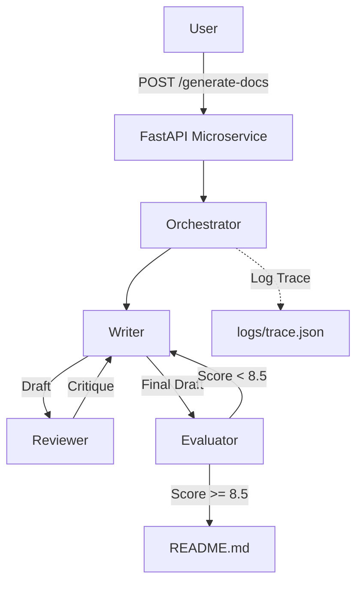

# Agentic Doc Validator - Enterprise AI Edition

Piattaforma avanzata per la generazione automatica di documentazione tecnica tramite **Agenti AI Autonomi** (Writer, Reviewer, Evaluator, Optimizer). 
Il sistema utilizza l'SDK Google GenAI per orchestrare un flusso di lavoro che simula un team di sviluppo umano.

## 🌟 Key Features

### 1. Multi-Agent Reasoning Loop
Non un semplice script "genera testo". 4 Agenti collaborano:
*   **Writer**: Analizza complessità O(n) e scrive.
*   **Reviewer**: Critica logicamente la bozza.
*   **Evaluator**: Assegna voti numerici (0-10) su accuratezza e completezza.
*   **Optimizer**: Riscrive il codice Python se rileva inefficienze (Self-Healing).

### 2. Observability & Tracing (New!)
Ogni "pensiero" (prompt) e "azione" (response) degli agenti viene tracciato per debugging e auditing.
*   **Logs**: `logs/trace_TIMESTAMP.json` contiene la conversazione completa.
*   **Dashboard**: Il sistema è compatibile con visualizzatori JSON per ricostruire il flusso decisionale.

### 3. Automated QA & Evaluation
Include un "Gold Standard" dataset per validare le performance del modello in scenari critici:
*   `eval_set/perfect_code.py`: Baseline.
*   `eval_set/buggy_code.py`: Test rilevazione bug.
*   `eval_set/inefficient_code.py`: Test capacità di ottimizzazione.

## 🏗 Architettura



## 🚀 Utilizzo

### Installazione
```bash
python3 -m venv venv
source venv/bin/activate
pip install -r requirements.txt
# Configura .env con GOOGLE_API_KEY
```

### Comandi Rapidi

**1. Lanciare il Microservizio API**
```bash
./venv/bin/uvicorn src.app:app --reload
# Endpoint: POST http://localhost:8000/generate-docs
```

**2. Eseguire Workflow Documentale (CLI)**
```bash
./venv/bin/python3 src/multi_agent_doc_gen.py
# Output: DOCS_LOGIC.md e logs/trace_*.json
```

**3. Ottimizzazione Autonoma Codice**
```bash
./venv/bin/python3 src/optimizer_agent.py
# Applica patch solo se i test passano!
```

## 📊 Dashboard & Monitoring (Simulated)

Il sistema produce trace logs compatibili con i principali tool di LLM Observability. 
Esempio log structure:
```json
{
  "role": "Evaluator",
  "thought_process_prompt": "Evaluate technical accuracy...",
  "action_output": "{\"score\": 9.5, \"feedback\": \"Excellent O(N) analysis\"}"
}
```
*Screenshot: ADK Web UI Visualization (Placeholder)*
> Immagina qui una visualizzazione a nodi del flusso di pensiero degli agenti.

## 📂 Struttura Progetto
*   `src/`: Codice sorgente agentico (`multi_agent_doc_gen.py`, `app.py`).
*   `logs/`: Dump delle esecuzioni (Audit Trail).
*   `eval_set/`: Dataset di validazione per QA.
*   `requirements.txt`: Dipendenze (FastAPI, Google GenAI).

---
*Progettato per dimostrare l'eccellenza nell'AI Engineering e nell'Agentic Design.*
