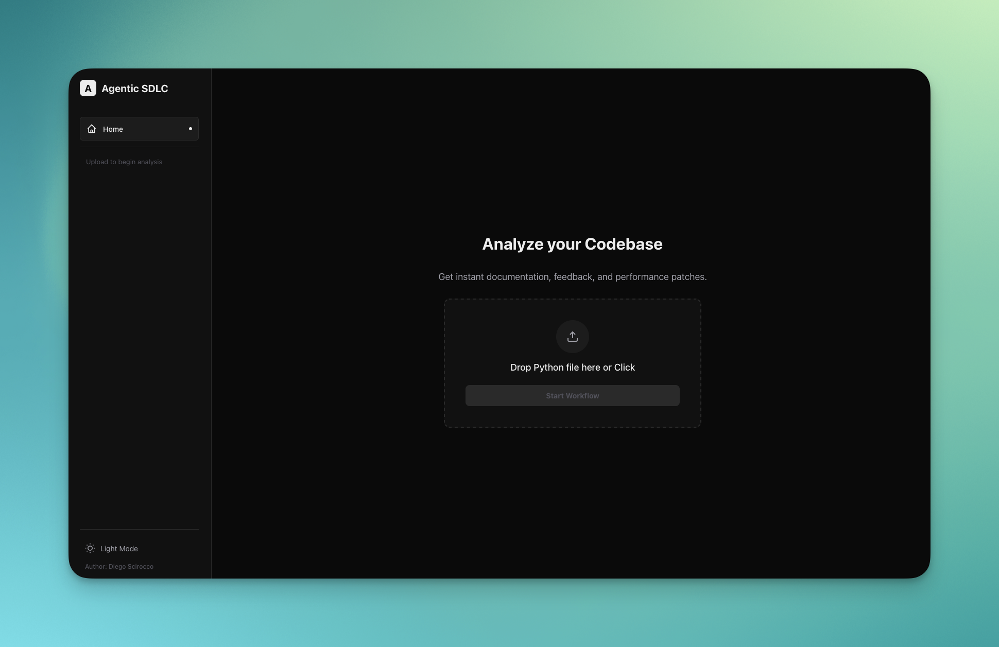
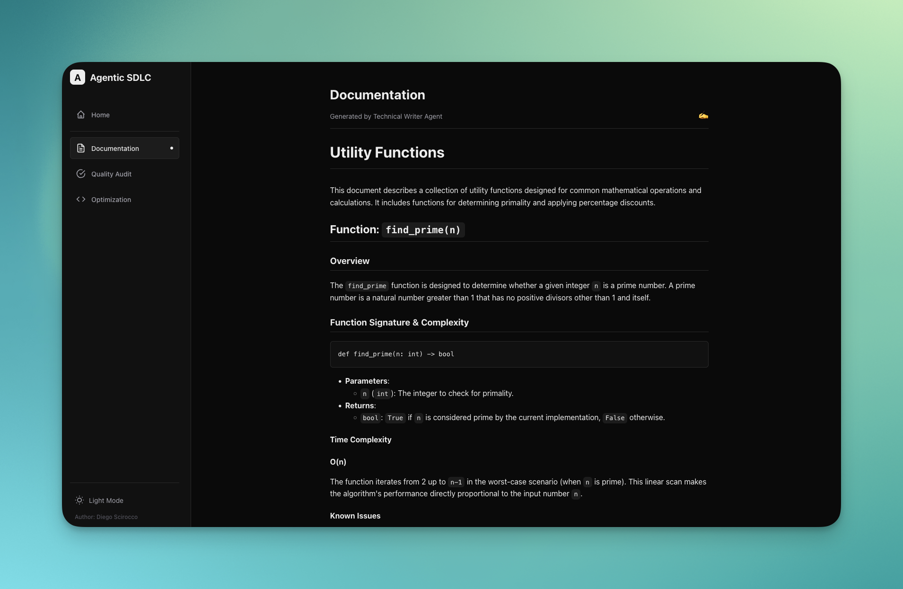
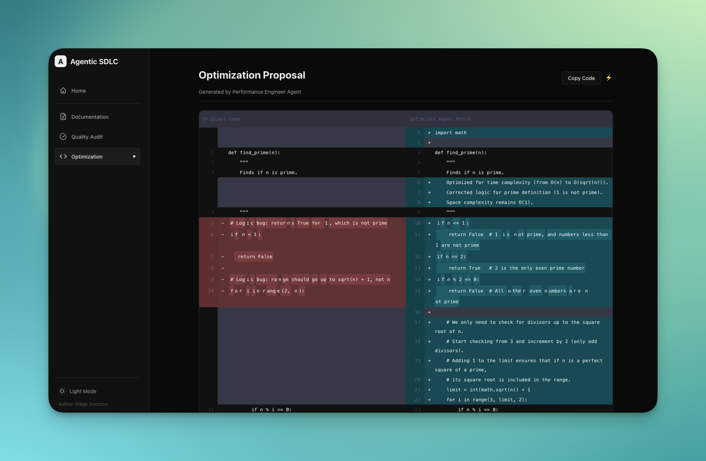

# Agentic SDLC



## Overview
Agentic SDLC is an intelligent, automated development tool designed to streamline the software lifecycle. Leveraging Google's advanced Gemini models and an Agentic workflow, it provides instant documentation, quality audits, and code optimization proposals through a unified, modern interface.

## Key Features
- **Automated Documentation**: Utilizes a Technical Writer Agent to generate comprehensive, professional Markdown documentation.
- **Quality Assurance**: A Quality Auditor Agent inspects code for accuracy, completeness, and readability.
- **Performance Engineering**: A Performance Engineer Agent identifies bottlenecks and automatically proposes optimized code solutions.
- **Parallel Processing**: Powered by `asyncio` for rapid, concurrent multi-agent analysis.
- **Modern Dashboard**: A responsive Next.js web interface featuring Dark/Light modes, visual diffing, and real-time status updates.

## Visual Walkthrough

### 1. Automated Documentation
The **Technical Writer Agent** generates professional-grade documentation directly from source code.


### 2. Quality Audit
The **Quality Auditor Agent** scores the code and identifies issues with a clean scorecard interface.


### 3. Optimization & Diffing
The **Performance Engineer Agent** proposes optimized code, visualized continuously with a side-by-side diff viewer.


## Architecture
The system consists of two main components:
1.  **Backend (Python/FastAPI)**: Orchestrates the multi-agent swarm using `google-genai`. It handles the prompt engineering and model fallback logic.
2.  **Frontend (Next.js)**: Provides a premium user experience for file uploads, result visualization, and code comparison.

## Project Structure
- `src/`: Core backend source code (API and Workflow Engine).
- `web/`: Frontend application (Next.js).
- `tests/`: Unit and integration tests.
- `scripts/`: Utility and benchmark scripts.
- `eval_set/`: Sample code files for evaluation.

## Installation

### Prerequisites
- Python 3.9+
- Node.js 18+
- Google Gemini API Key

### Backend Setup
1.  Create a virtual environment:
    ```bash
    python -m venv venv
    source venv/bin/activate
    ```
2.  Install dependencies:
    ```bash
    pip install -r requirements.txt
    ```
3.  Configure Environment:
    Create a `.env` file in the root directory:
    ```env
    GOOGLE_API_KEY=your_api_key_here
    ```

### Frontend Setup
1.  Navigate to the web directory:
    ```bash
    cd web
    ```
2.  Install dependencies:
    ```bash
    npm install
    ```

## Usage

### 1. Start the Backend
From the project root:
```bash
./venv/bin/uvicorn src.app:app --reload
```
The API will run at `http://localhost:8000`.

### 2. Start the Frontend
From the project root:
```bash
npm run dev --prefix web
```
The Dashboard will be accessible at `http://localhost:3000`.

### 3. Analyze Code
1.  Open the Dashboard.
2.  Upload a Python (`.py`) file.
3.  View the real-time analysis across Documentation, Quality Audit, and Optimization tabs.

## Credits
Created by **Diego Scirocco**.
Powered by Google Gemini Models.
